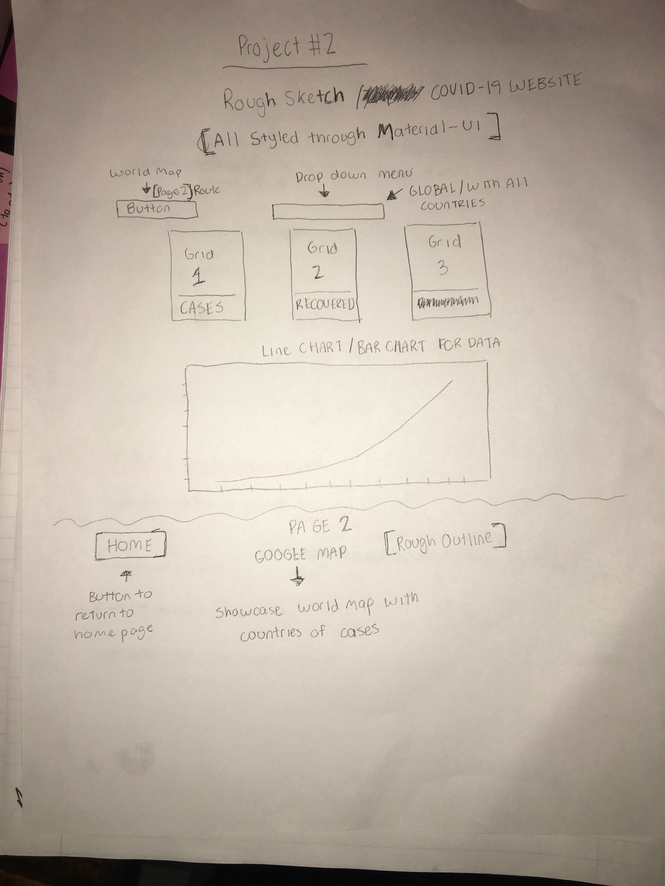

## Project Description

My app will be a data tracker for Covid-19. The user will be able to see the data in the form of recovered, deaths, cases globally. I will also like to add a google map and have the user see the representation of cases on the map.

## Wireframes

## MVP User Stories

- As a user, I want to see the data globally and in grids and have a dropdown menu for the user to pick the data of his country.
- As a user, I would also like to incorporate a google map for the user to visually see the data on a global scale
- As a user, I want to put a bar/line chart to represent data and have it be mobile friendly.

## Api

https://documenter.getpostman.com/view/10808728/SzS8rjbc?version=latest

## Component Hierarchy

- Plan on using material-ui for styling
- https://material-ui.com

